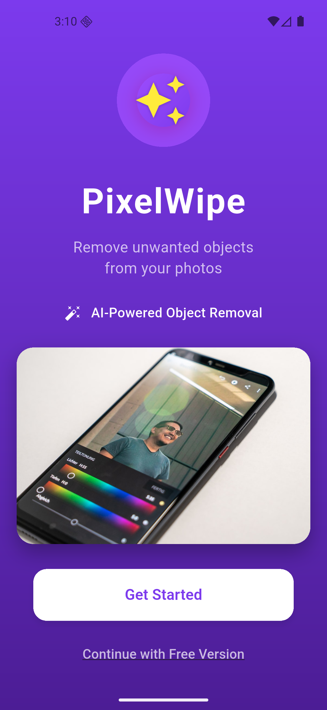
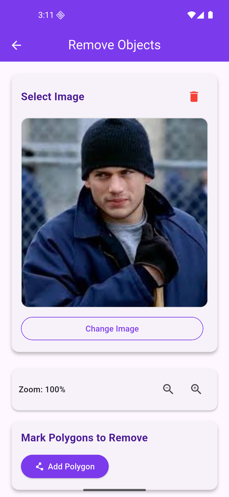
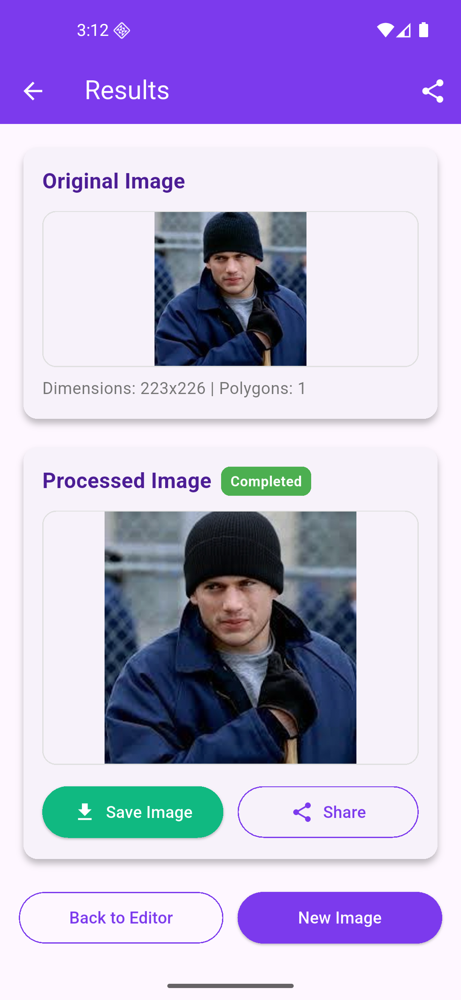

#  Flutter AI Image Enhancer

A **Flutter-based AI-powered image enhancement app** that uses advanced artificial intelligence models to automatically enhance image quality, color, and clarity.  
Designed with a **modern, intuitive UI** and powered by **Firebase** for seamless authentication, data storage, and cloud connectivity.

---

##  Features

 **AI Image Enhancement**  
- Automatically improves brightness, contrast, and sharpness.  
- Works with all types of images — portraits, landscapes, low-light, or noisy images.  

 **Beautiful UI**  
- Built with Flutter’s Material 3 design principles.  
- Smooth transitions, responsive layout, and clean user experience.  

 **Firebase Integration**  
- Secure user authentication (Email/Google Sign-In).  
- Cloud Storage for saving and retrieving enhanced images.  
- Real-time Database or Firestore support for managing user data.

⚡ **Cross-Platform Support**  
- Fully responsive on **Android**, **iOS**, and **Web**.  

---

##  Tech Stack

| Technology | Purpose |
|-------------|----------|
| **Flutter** | Frontend UI development |
| **Firebase** | Auth, Storage, Database |
| **AI/ML API** | Image enhancement and optimization |
| **Dart** | Core app logic and development |

---

##  How It Works

1. **Upload or capture** an image.
2. 
3. The app sends it to an **AI enhancement model** (cloud or local).  
4. The enhanced image is displayed with before/after comparison.  
5. Users can **save, share, or store** the enhanced image in Firebase Cloud Storage.





---

##  Installation & Setup

### Prerequisites
- Flutter SDK (latest stable version)  
- Firebase project with necessary configurations  
- Android Studio / VS Code  

### Steps
```bash
# Clone the repository
git clone https://github.com/yourusername/Flutter_mobile_App.git

# Navigate to project directory
cd Flutter_mobile_App

# Get dependencies
flutter pub get

# Run the app
flutter run
